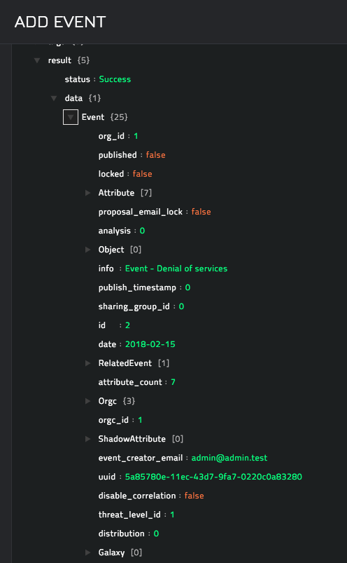
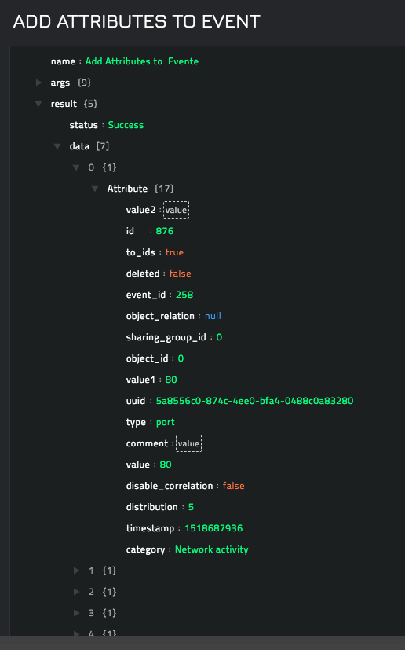
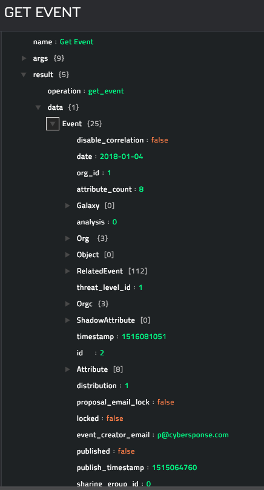
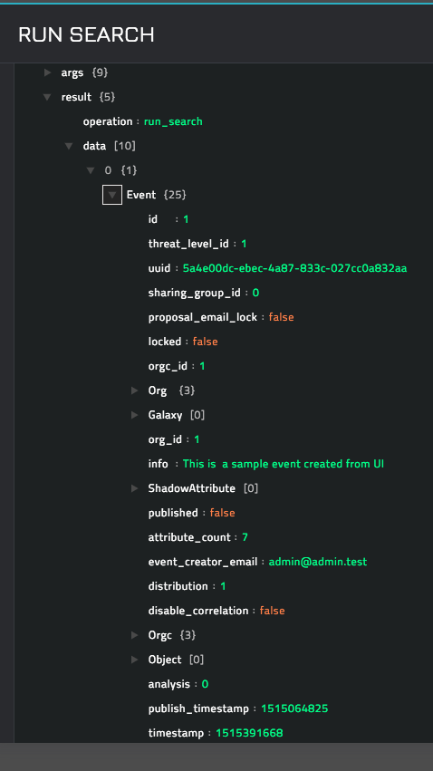
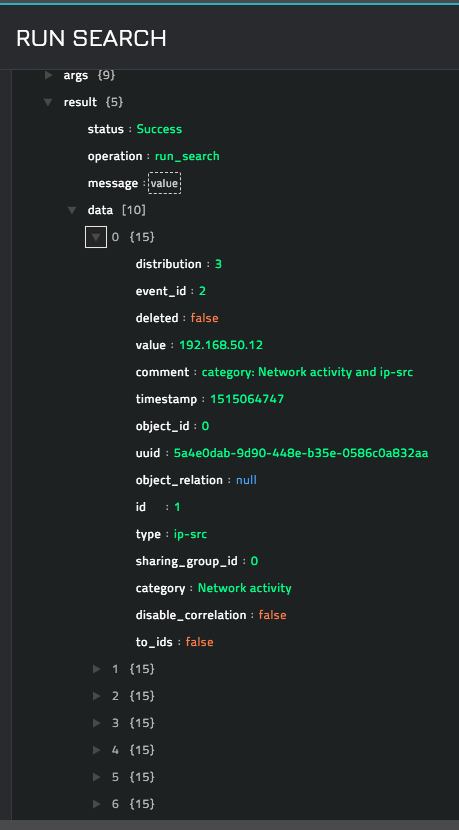
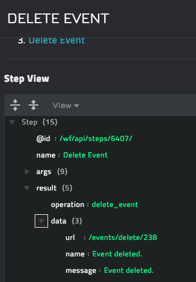
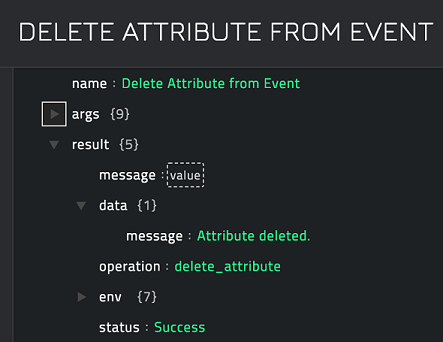

## About the connector

The Malware Information Sharing Platform (MISP) tool facilitates the exchange of Indicators of Compromise (IOCs) about targeted malware and attacks, within your community of trusted members. MISP is a distributed IOC database containing technical and nontechnical information. Exchanging such information should result in faster detection of targeted attacks and improve the detection ratio, and also reduce the number of false positives.

This document provides information about the MISP connector, which facilitates automated interactions, with a MISP server using CyOPs™ playbooks. Add the MISP connector as a step in CyOPs™ playbooks and perform automated operations, such as creating an event in MISP and adding attributes in MISP.

### Version information

Connector Version: 1.0.0

Compatibility with CyOPs™ Versions: 4.10.1-109 and later

Compatibility with MISP Versions: 2.4 and later

## Installing the connector

All connectors provided by  CyOPs™ are delivered using a CyOPs™ repository. Therefore, you must set up your CyOPs™ repository and use the `yum` command to install connectors:

`yum install cyops-connector-misp`

To update a  CyOPs™-provided connector use the following command:

`yum update cyops-connector-misp`

To remove a  CyOPs™-provided connector use the following command:

`yum remove cyops-connector-misp`

The process to write your own custom connector is defined in the `Building a custom connector` topic.

## Prerequisites to configuring the connector

- You must have the URL of the MISP server to which you will connect and perform the automated operations.
- You must have the API Key used to access the MISP server.
- To access the CyOPs™ UI, ensure that port 443 is open through the firewall for the CyOPs™ instance.

## Configuring the connector

!!! Note  
		This procedure assumes that you are using CyOPs™ version 4.10.1. If you are using a different version of CyOPs™, such as CyOPs™ 4.9, then it is possible that the CyOPs™ UI navigation is different. Refer to the CyOPs™ documentation of that particular version for details about CyOPs™ navigation.

1. In CyOPs™, on the left pane, click **Automation** > **Connectors**.   
   On the `Connectors` page, you will see the `MISP` connector.
2. To configure the connector parameters, click **Configure** and enter the required configuration details in the **Configurations** tab.  
   You must provide configuration parameters such as the hostname or IP address of the MISP server and the API key to access the MISP server to which you will connect and perform automated operations.   
   For a complete list of configuration parameters, see the [Configuration parameters](#Configuration-parameters) section.  
   **Note**: You can add multiple configurations if you have more than one MISP server instances in your environment. You must, therefore, specify a unique `Name` to identify each configuration in your environment.  
   If you have previous versions of a connector and you are configuring a newer version of that connector, with the same configuration parameters, then CyOPs™ fetches the configuration and input parameters of the latest available version of that connector. For example, If you have 1.0.0, 1.1.0, and 1.2.0 versions of the MISP connector and you are configuring the 1.3.0 version of the MISP connector, then while configuring the 1.3.0 version,  CyOPs™ will fetch the configuration and input parameters from the 1.2.0 version of the MISP connector. You can review the configuration and input parameters, and then decide to change them or leave them unchanged. 
3. To save your configuration, click **Save**.  
   To view the list of actions that can be performed by the connector, click the **Actions**
   tab.  
   To view the list of playbooks bundled with the connector, click the **Sample Playbooks** tab. Refer to the [Included Playbooks](#Included-playbooks) section for details on the bundled playbooks. You can see the bundled playbooks in the **Automation** > **Playbooks** section in  CyOPs™ after importing the MISP connector.  
4. (Optional) To check the connectivity to the MISP server and the validity of the API Key provided perform a health check, by clicking the **Refresh** icon that is present in the `Health Check` bar.  
   If all the details are correct and the MISP server is available then the health check status displays as `Available`.  
   If any or all the details are incorrect or the MISP server is unavailable then the health check status displays as `Disconnected`.

### Configuration parameters

In CyOPs™, on the Connectors page, select the **MISP** connector and click **Configure** to configure the following parameters:

| Parameter   | Description                                                  |
| ----------- | ------------------------------------------------------------ |
| Server Name | Hostname or IP address of the MISP server to which you will connect and perform automated operations. |
| API Key     | API key that is configured for your account for using the MISP server. |
| Verify SSL  | Specifies whether the SSL certificate for the server is to be verified or not. By default, this option is set as `True`. |

**Note**: You can store API keys and other confidential data using the `Secrets` store provided in CyOPs™. When you store data in the `Secrets` store, users cannot see that data. However, they can use this data when required. For more information about the `Secrets` store, see *Configuring the Secrets store* in the "Administration" guide.

## Actions supported by the connector

The following automated operations can be included in playbooks and you can also use the annotations to access operations from CyOPs™ release 4.10.0 onwards:

| Function                    | Description                                                  | Annotation and Category            |
| --------------------------- | ------------------------------------------------------------ | ---------------------------------- |
| Add Event                   | Creates an event and adds the new event in MISP.             | add_event   Investigation     |
| Add Attributes to Event     | Adds attributes that you specify to a MISP event.            | update_record   Investigation |
| Get Event                   | Retrieves information about an event based on the event ID that you specify. | get_event   Investigation     |
| Run Search                  | Searches for events or attributes in MISP based on the parameters you specify. | run_search   Investigation    |
| Delete Event                | Deletes an event from MISP based on the event ID that you specify. | delete_event   Miscellaneous  |
| Delete Attribute from Event | Deletes an attribute from MISP based on the attribute ID that you specify. | update_event   Miscellaneous  |

### operation: Add Event

#### Input parameters

| Parameter                         | Description                                                  |
| --------------------------------- | ------------------------------------------------------------ |
| Distribution                      | Setting controls on who can view this event once it is published and eventually when it gets pulled. Apart from being able to set which users on this server are allowed to see the event, this also controls whether or not the event will be synchronized to other servers.   You can choose between **Your organization only**, **This community only**, **Connected communities**, or **All communities**. |
| Threat Level                      | Indicates the risk level of the event.    You can categorize events into different threat categories, which are **Low**, **Medium**, or **High**. You can also alternatively leave this field as **Undefined**. |
| Analysis Status                   | Indicates the current stage of analysis of the event.    You can choose between **Initial**, **Ongoing**, or **Completed**. |
| Event Information                 | Brief description of the malware or event you are creating, including the internal reference for the event.   You can add detailed description for the event by adding attributes to the event after the event is created. |
| Source IP                         | Source IP that will be added as an attribute while creating the event. |
| Destination IP                    | Destination IP that will be added as an attribute while creating the event. |
| Domain                            | Domain that will be added as an attribute while creating the event. |
| Source Email                      | Source email address that will be added as an attribute while creating the event. |
| Destination Email                 | Destination email address that will be added as an attribute while creating the event. |
| URL                               | URL that will be added as an attribute while creating the event. |
| Attribute Distribution            | Setting controls on who can view this attribute once it is published. This field inherits the distribution that is set on its parent event. |
| Other Attributes                  | Other attributes that you can add to the MISP event   This parameter takes the input in the `dict` format, containing a key and value pair.   For example, `{“port”: 80, “md5”: “0042cacc71934ec8560ea9876801d5a7”}` |
| Use Attribute as an IDS Signature | Select this checkbox if you want to add attributes for Intrusion Detection System (IDS) and this sets the `to_IDS` flag to `True` in MISP. |
| Comment                           | Comments can be added for attributes that will be used for informational purposes only and not for correlations. |

#### Output

The JSON output contains the details of the newly added event.

Following image displays a sample output:

### operation: Add Attributes to Event

#### Input parameters

| Parameter                         | Description                                                  |
| --------------------------------- | ------------------------------------------------------------ |
| Event ID                          | ID of the MISP event to which you want to add attributes.    |
| Source IP                         | Source IP to be added as an attribute.                       |
| Destination IP                    | Destination IP to be added as an attribute.                  |
| Domain                            | Domain to be added as an attribute.                          |
| Source Email                      | Source email address to be added as an attribute.            |
| Destination Email                 | Destination email address to be added as an attribute.       |
| URL                               | URL to be added as an attribute.                             |
| Attribute Distribution            | Setting controls on who can view this attribute once it is published. This field inherits the distribution that is set on its parent event. |
| Other Attributes                  | Other attributes that you can add to the MISP event   This parameter takes the input in the `dict` format, containing a key and value pair.   For example, `{“port”: 80, “md5”: “0042cacc71934ec8560ea9876801d5a7”}` |
| Use Attribute as an IDS Signature | Select this checkbox if you want to add attributes for Intrusion Detection System (IDS) and this sets the `to_IDS` flag to `True` in MISP. |
| Comment                           | Comments can be added for attributes that will be used for informational purposes only and not for correlations. |

#### Output

The JSON output contains the details of the attributes added to the event based on the Event ID you have specified.

Following image displays a sample output:

### operation: Get Event

#### Input parameters

| Parameter | Description                              |
| --------- | ---------------------------------------- |
| Event ID  | ID of the MISP event for which you want to retrieve information. |

#### Output

The JSON output contains the details of the event based on the Event ID you have specified.

Following image displays a sample output:

### operation: Run Search

#### Input parameters

| Parameter                                                   | Description                                                  |
| ----------------------------------------------------------- | ------------------------------------------------------------ |
| Controller                                                  | Specifies whether you want to search **Attributes** or **Events**. |
| Maximum Results                                             | (Optional) Maximum number of results that you want to return.   By default this is set to **10**. |
| Event IDs (CSV Format)                                      | (Optional) IDs of events based on which you want to run the search. |
| Tags                                                        | (Optional) Tags based on which you want to run the search.   |
| Attribute Type                                              | (Optional) Attribute type based on which you want to run the search. |
| Category                                                    | (Optional) Category based on which you want to run the search. |
| By UUID                                                     | (Optional) UUID based on which you want to run the search.   |
| Tags                                                        | (Optional) Tags based on which you want to run the search.   |
| Only Published Events(Applicable when controller is Events) | Select this check box, if you want to return only published events.   **Note**: This is only applicable when you have selected the `Controller` as **Event**. |
| Other Filters                                               | (Optional) Other filters based on which you want to run the search.   This parameter takes the input in the `dict` format, containing a key and value pair.   For example, `{“values”:”8.8.8.8”, “not_values”:”google.com” }` |

#### Output

The JSON output contains details of the event(s) or attribute(s) that matches the query you have specified.

Following image displays a sample output, when you have specified **Events** as the controller:

Following image displays a sample output, when you have specified **Attributes** as the controller:

### operation: Delete Event

#### Input parameters

| Parameter | Description                                   |
| --------- | --------------------------------------------- |
| Event ID  | ID of the MISP event that you want to delete. |

#### Output

The JSON output contains a status message specifying whether or not the event you have specified is deleted.

Following image displays a sample output:

### operation: Delete Attribute from Event

#### Input parameters

| Parameter    | Description                                       |
| ------------ | ------------------------------------------------- |
| Attribute ID | ID of the MISP attribute that you want to delete. |

#### Output

The JSON output contains a status message specifying whether or not the attribute you have specified is deleted.

Following image displays a sample output:

## Included playbooks

The `Sample-MISP-1.0.0`  playbook collection comes bundled with the MISP connector. This playbook contains steps using which you can perform all supported actions. You can see the bundled playbooks in the **Automation** > **Playbooks** section in CyOPs™ after importing the MISP connector.

- Add Attributes to Event
- Add Event
- Delete Attribute from Event
- Delete Event
- Get Event
- Run Search

**Note**: If you are planning to use any of the sample playbooks in your environment, ensure that you clone those playbooks and move them to a different collection, since the sample playbook collection gets deleted during connector upgrade and delete.